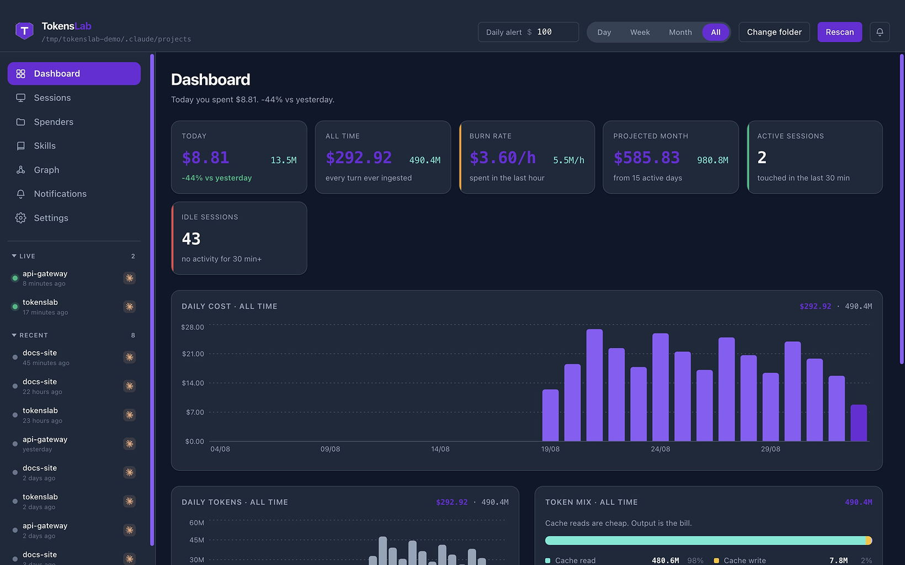

<p align="center">
  <a href="https://tokenslab.tech">
    
  </a>
</p>

<h1 align="center">TokensLab</h1>

<p align="center">
  <strong>The cost lab for your AI.</strong><br>
  Spend × sessions × tokens — offline, private, free to download.
</p>

<p align="center">
  <a href="https://tokenslab.tech/download.html"></a>
  <a href="https://tokenslab.tech"></a>
  <a href="https://github.com/TokensLab/tokenslab-releases/releases/latest"></a>
</p>

<p align="center">
  
  
  
  
</p>

<p align="center">
  
</p>

Claude Code spend is priced live against Anthropic’s rate card. Cursor, Codex and Gemini sit on the tray as sessions — not a dollar invoice. The app never phones home.

**[Download the beta](https://tokenslab.tech/download.html)** · **[Getting started](https://tokenslab.tech/docs/getting-started.html)** · **[Public installers](https://github.com/TokensLab/tokenslab-releases)**

## Prompt for your AI agent

Paste this into Cursor, Claude Code or Codex and let it install TokensLab.

```
Install TokensLab on this machine.

TokensLab is an offline-first desktop app. It monitors spend, sessions, tokens and productivity from local AI coding logs. Dollar spend is live for Claude Code only. Cursor, Codex and Gemini may appear on the tray as sessions — do not say they have a priced invoice.

Steps:
1. Detect the OS.
2. Windows or Linux: download the latest installer from https://tokenslab.tech/download.html (binaries also at https://github.com/TokensLab/tokenslab-releases/releases/latest). macOS is not shipping yet — say so and stop. Do not invent a .dmg.
3. Windows: run TokensLab-windows.exe. If SmartScreen appears: More info → Run anyway.
4. Linux: chmod +x the AppImage and run it. Current builds turn Chromium sandbox off themselves. If an older file still fails with a sandbox error, run: ./TokensLab-linux.AppImage --no-sandbox
5. Launch TokensLab. Point it at local Claude Code session logs. Do not create an account. Do not send data anywhere. Do not npm or pip install a tokenslab package.

When you are done, tell me the OS, the file you used, and that the app is open.
```

## What you get

| | |
| --- | --- |
| **Spend** | Cache-aware dollars for Claude Code. Unpriced models are a lower bound, never “free.” |
| **Sessions** | Live vs idle. Quiet sessions still cost money. |
| **Tokens** | Input, output, cache writes and cache reads, kept separate. |
| **Productivity** | Which files and skills actually show up in your logs. |

Same 66 MB of real Claude Code logs: naive arithmetic **$15,680.35** → cache-aware **$3,123.97**.

## Getting started

1. Download the Windows `.exe` or Linux AppImage from **[tokenslab.tech/download](https://tokenslab.tech/download.html)**. macOS follows this weekend after signing.
2. Point the app at `~/.claude/projects`. No account. Nothing leaves the machine.
3. Read today, all-time, burn rate, and idle sessions.

Full walkthrough: **[Getting started](https://tokenslab.tech/docs/getting-started.html)** · Linux AppImage note lives with the [public installers](https://github.com/TokensLab/tokenslab-releases/blob/main/docs/getting-started.md).

Public beta. Source stays private at launch. Mail: [hello@tokenslab.tech](mailto:hello@tokenslab.tech)
